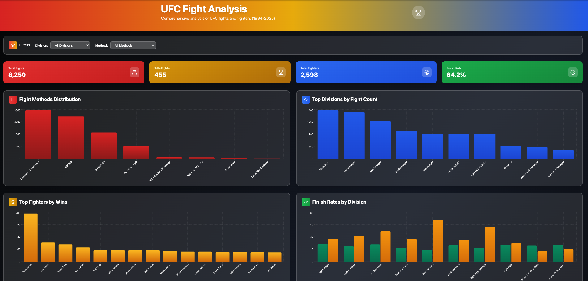
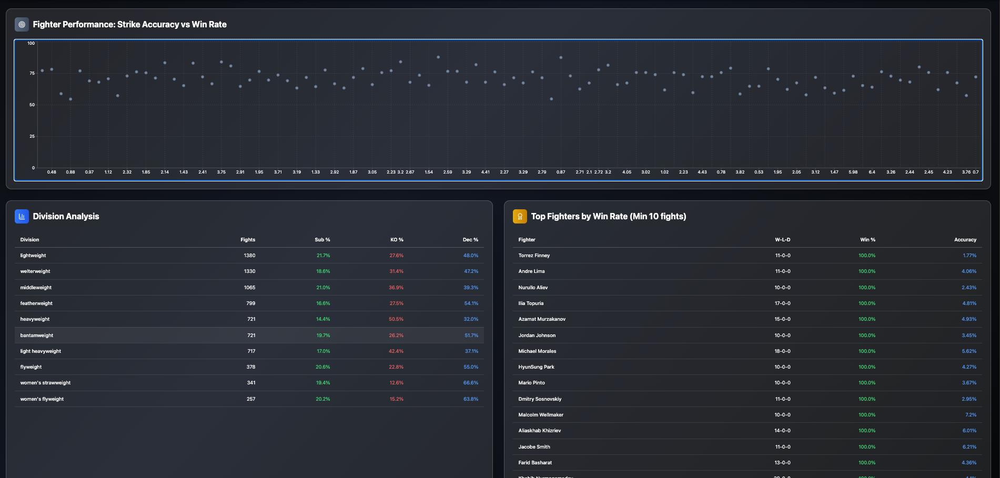
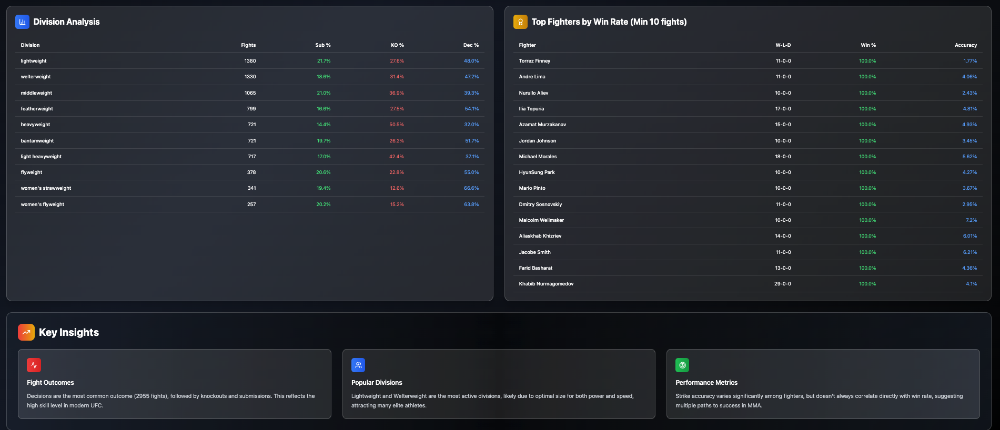

# UFC Analysis Dashboard

A modern, data-driven dashboard for exploring and visualizing UFC fight and fighter statistics. Built with React, TypeScript, and Tailwind CSS, this project showcases interactive data analysis using real UFC datasets with a professional, combat sports-inspired design.

## 🥊 Dashboard Preview


*Main dashboard view with key metrics and fight analysis*


*Interactive charts showing fight methods, divisions, and fighter performance*


*Key insights found through analysis*

## ✨ Features

- **Interactive Visualizations** - Dynamic charts and graphs for UFC fight outcomes and fighter stats
- **Real-time Filtering** - Filter by division, fight method, and more
- **Key Performance Indicators** - Total fights, title fights, finish rates, and fighter counts
- **Professional Design** - UFC-inspired color scheme with red, black, gold, and blue
- **Responsive Interface** - Works seamlessly on desktop, tablet, and mobile
- **Data-driven Insights** - Comprehensive analysis of fight statistics and trends

## 📊 Data Sources

- `public/fight_details.csv`: Detailed records of UFC fights (1994-2025)
- `public/fighter_details.csv`: Biographical and statistical data for UFC fighters

## 🚀 Live Demo

**View the live dashboard:** [https://mikewayne92.github.io/ufc_analysis](https://mikewayne92.github.io/ufc_analysis)

## 🚀 Getting Started

### Prerequisites
- Node.js (v16+ recommended)
- npm or yarn

### Installation
```bash
# Clone the repository
git clone https://github.com/MikeWayne92/ufc_analysis
cd ufc_analysis

# Install dependencies
npm install
# or
yarn install
```

### Running the Dashboard
```bash
npm start
# or
yarn start
```

The dashboard will be available at `http://localhost:3000`.

## 🏗️ Project Structure
```
ufc_analysis/
├── public/
│   ├── fight_details.csv
│   ├── fighter_details.csv
│   └── index.html
├── src/
│   ├── ufc_dashboard.tsx    # Main dashboard component
│   ├── index.tsx           # App entry point
│   └── index.css           # Tailwind CSS imports
├── dashboard-preview-1.png  # Dashboard screenshots
├── dashboard-preview-2.png
├── dashboard-preview-3.png
├── README.md
├── package.json
├── tailwind.config.js
├── tsconfig.json
└── ...
```

## 🎨 Design Features

- **UFC-Inspired Color Palette**: Red, black, gold, silver, blue, and green
- **Glassmorphism Effects**: Modern transparent cards with backdrop blur
- **Gradient Charts**: Beautiful gradient-filled data visualizations
- **Hover Animations**: Interactive elements with smooth transitions
- **Professional Typography**: Clean, readable text hierarchy

## 📱 Responsive Design

The dashboard is fully responsive and optimized for:
- **Desktop** (1200px+) - Full dashboard with all charts visible
- **Tablet** (768px - 1199px) - Adjusted layout with stacked charts
- **Mobile** (< 768px) - Single-column layout with touch-friendly controls

## 🚀 Deployment

You can deploy this dashboard to any static hosting provider. Here are some common options:

### GitHub Pages
```bash
# Build the project
npm run build

# Deploy using gh-pages
npm install --save-dev gh-pages
npm run deploy
```

### Vercel
- Import your repository into [Vercel](https://vercel.com/)
- Set the build command to `npm run build` and the output directory to `build`

### Netlify
- Import your repository into [Netlify](https://www.netlify.com/)
- Set the build command to `npm run build` and the publish directory to `build`

## 🛠️ Technologies Used

- **React 18** - Modern React with hooks and functional components
- **TypeScript** - Type-safe JavaScript development
- **Tailwind CSS** - Utility-first CSS framework
- **Recharts** - Beautiful, composable charting library
- **Lucide React** - Beautiful & consistent icon toolkit

## 📈 Data Analysis Features

- **Fight Methods Distribution** - Breakdown of KO/TKO, submissions, and decisions
- **Division Statistics** - Fight counts and finish rates by weight class
- **Top Fighters Analysis** - Win rates and performance metrics
- **Strike Accuracy Correlation** - Relationship between accuracy and success
- **Title Fight Tracking** - Championship bout statistics

## 🤝 Contributing

Pull requests are welcome! For major changes, please open an issue first to discuss what you would like to change.

### Development Setup
```bash
# Install dependencies
npm install

# Start development server
npm start

# Run linting
npm run lint

# Build for production
npm run build
```

## 📄 License

This project is licensed under the MIT License. See the [LICENSE](LICENSE) file for details.

## 🙏 Acknowledgments

- UFC for providing the inspiration and data
- The React and TypeScript communities for excellent tooling
- Recharts for beautiful data visualizations
- Tailwind CSS for the amazing utility-first framework 